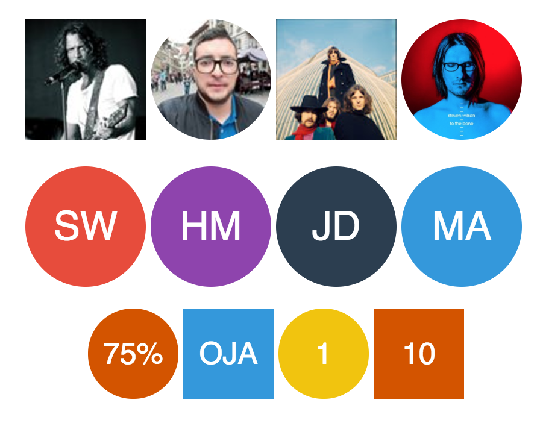

## &lt;ngx-avatar&gt;
[](https://badge.fury.io/js/ngx-avatar) [](https://www.npmjs.com/package/ngx-avatar) [](https://travis-ci.org/HaithemMosbahi/ngx-avatar)
[](https://angular.io/styleguide)

A universal avatar component for Angular 2+ applications that fetches / generates avatar based on the information you have about the user. The component has a fallback system that if for example an invalid Facebook ID is used it will try google ID and so on.

You can use this component whether you have a single source or a multiple avatar sources. In this case the fallback system will fetch the first valid avatar.

Moreover, the component can shows name initials or simple value as avatar.




 Supported avatar sources:

 * Facebook
 * Google
 * Twitter
 * Vkontakte (VK)
 * Skype
 * Gravatar
 * Github
 * Custom image
 * name initials
 * value

 The fallback system uses the same order as the above source list, Facebook has the highest priority, if it fails, google source will be used, and so on.

 If you enjoy watching videos, check out this [tutorial](https://medium.com/letsboot/lets-play-with-ngx-avatar-ec585dc39161) on medium which explains how to use ngx-avatar in your angular application.
 
 Check out this [link](https://stackblitz.com/edit/ngx-avatar-demo) to play with ngx-avatar :grinning:

## Installation

Install avatar component using [NPM](https://www.npmjs.com/)::

```bash
$ npm install ngx-avatar --save
```
Or [download as ZIP](https://github.com/HaithemMosbahi/ngx-avatar/archive/master.zip).


## Usage

1. Import AvatarModule :

Once you have installed ngx-avatar, you can import it in your `AppModule`:

```typescript
import { BrowserModule } from '@angular/platform-browser';
import { NgModule } from '@angular/core';

import { AppComponent } from './app.component';

// Import your AvatarModule
import { AvatarModule } from 'ngx-avatar';

@NgModule({
  declarations: [
    AppComponent
  ],
  imports: [
    BrowserModule,
    // Specify AvatarModule as an import
    AvatarModule
  ],
  providers: [],
  bootstrap: [AppComponent]
})
export class AppModule { }
```
2. Start using it:

Once the AvatarModule is imported, you can start using the component in your Angular application:

```html
<ngx-avatar></ngx-avatar>
```
## Examples

```html
<ngx-avatar facebookId="1508319875"></ngx-avatar>
<ngx-avatar googleId="1508319875"></ngx-avatar>
<ngx-avatar twitterId="1508319875"></ngx-avatar>
<ngx-avatar skypeId="1508319875"></ngx-avatar>
<ngx-avatar gravatarId="adde9b2b981a8083cf084c63ad86f753"></ngx-avatar>
<ngx-avatar gravatarId="user@gmail.com"></ngx-avatar>
<ngx-avatar src="assets/avatar.jpg"></ngx-avatar>
<ngx-avatar name="John Doe"></ngx-avatar>
<ngx-avatar value="75%"></ngx-avatar>

<ngx-avatar facebookId="userFacebookID" skypeId="userSkypeID"
 googleId="google" name="Haithem Mosbahi" src="assets/avatar.jpg"
 value="28%"  twitterId="twitter"
 gravatarId="adde9b2b981a8083cf084c63ad86f753" 
 size="100" [round]="true">
</ngx-avatar>

```
Check out this [file](https://github.com/HaithemMosbahi/ngx-avatar/blob/master/demo/src/app/app.component.html) for more examples on how to use ngx-avatar in your application.

## Demo
Check out this [link](https://ngx-avatar-demo.stackblitz.io/) for a live demo.
Also, you can play with ngx-avatar using an online editor [here](https://stackblitz.com/edit/ngx-avatar-demo) on stackblitz.

Moreover, the demo folder contains an application generated with angular cli that uses ngx-avatar component.

To run the demo application :
```bash
$ npm install
$ ng serve
```


## Options

|   Attribute   |      Type      | Default |                                              Description                                               |
| ------------- | ----------------- | ------- | ------------------------------------------------------------------------------------------------------ |
| `facebookId` | *string* |         | Facebook ID                                                                                                       |
| `googleId` | *string* |         |  Google ID                                                                                                     |
| `twitterId`   | *string*             |         | Twitter Handle                                                                                                       |
| `vkontakteId`   | *string*             |         | VK ID|
| `skypeId`    | *string*          |       |  Skype ID                                                                                                      |
| `gravatarId`    | *string*          |         | email or md5 email related to gravatar                                                                                                  |
| `githubId`    | *string*          |         | Github ID                                                                                      
| `src`         | *string*          |         | Fallback image to use                                                                                  |
| `name`        | *string*          |         | Will be used to generate avatar based on the initials of the person                                    |
| `value`       | *string*          |         | Show a value as avatar                                                                                 |
| `bgColor`       | *string*          | random  | Give the background a fixed color with a hex like for example #FF0000 |
| `fgColor`     | *string*          | #FFF  | Give the text a fixed color with a hex like for example #FF0000 |
| `size`        | *number*             | 50      | Size of the avatar                                                                                     |
| `textSizeRatio` | *number*             | 3      | For text based avatars the size of the text as a fragment of size (size / textSizeRatio)                                 |
| `round`       | *boolean*            | true   | Round the avatar corners                                                                               |
| `borderCorner`       | *number*            | 0   | Square avatars can have rounded corners using this property                                                                              |
| `borderColor`       | *string*            | undefined   | Add border with the given color. boder's default style is '1px solid borderColor'                                                                               |
| `style`         | *object*          |         | Style that will be applied on the root element
| `clickOnAvatar`         | *callback*          |         | Fired when the avatar is clicked. The component emits the source object that has been used to fetch the avatar.||

 The source object has the following properties:
 * sourceType : avatar source ( Facebook, twitter, etc)
 * sourceId : identifier of the user
 * getAvatar(size?) : method to fetch user avatar from the current source
## Release Notes
* 2.3 : Add support for github avatar
* 2.2 : Fix prod and aot build
* 2.1 : Bug fixes
* 2.0 : add support to vkontakte source
* 1.4 : background color is now generated based on the sum of ASCII values of avatar's text.
* 1.3 : Bug Fixes ( support dynamic avatar data )
* 1.2 : Add border related properties.
* 1.1 : Listen to click events on avatar and support retina display.
* 1.0 : Avatar component that fetches / generates user avatar from different sources.

## Development

To generate all `*.js`, `*.d.ts` and `*.metadata.json` files:

```bash
$ npm run build
```

To lint all `*.ts` files:

```bash
$ npm run lint
```


## Contributing

Contributions and all possible collaboration are welcome.

* Fork it!
* Create your feature branch: git checkout -b my-new-feature
* Commit your changes: git commit -am 'Add some feature'
* Push to the branch: git push origin my-new-feature
* Submit a pull request :D


## License

MIT © [Haithem Mosbahi](mailto:elmosbahihaithem@gmail.com)
